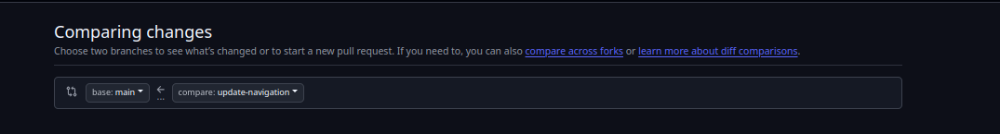
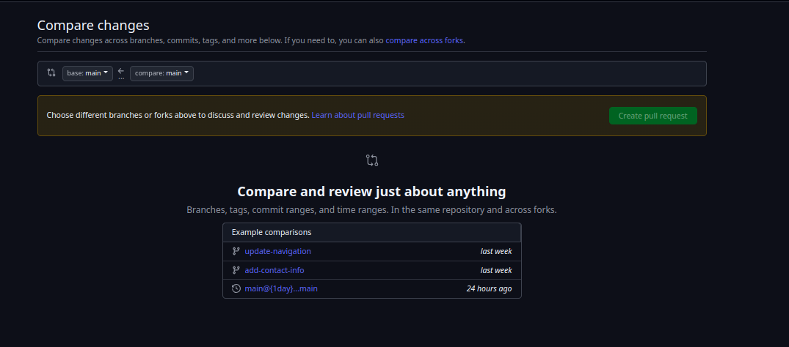
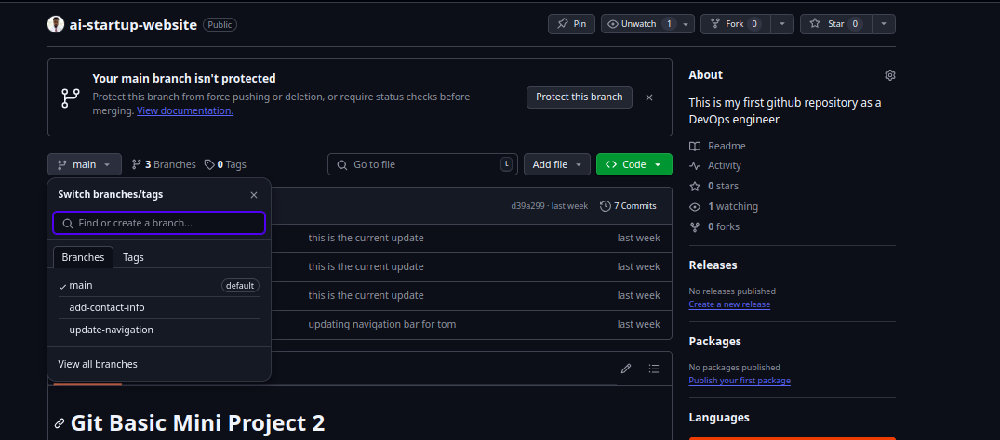
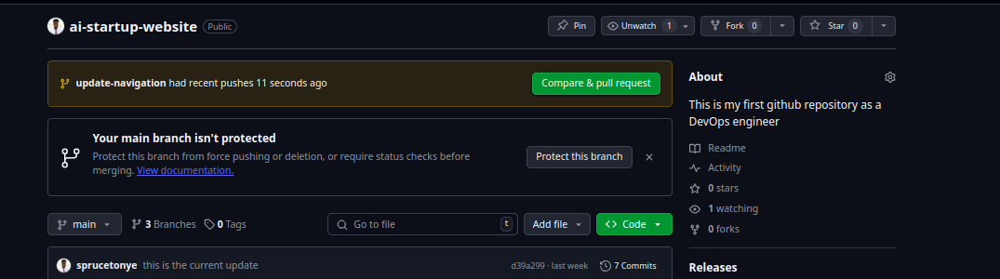

# Capstone Project - Git
<p> This is a capstone project that shows Tom and Jerry. </p>
<p> The submitted project showcases basic Git commands and workflows, including repository creation, branching, staging, committing </p>
<p> we are reworking on the project again</p>

## Task 1: Create a Pull Request
1. Created a new pull request on github.


1. Checking the list of contibutors.


1. Branch update & sychronization.


<!-- 1. Cloned to the local machine using the command line.
    <p> This command will create a local copy of the repository on your machine. </p>
```git clone <repository-url>```
    <p> The command will create a directory with the same name as the repository. </p> -->

<!--  -->

5. Moved changes to the repository `git commit -m 'I just edited the index.html file` command.



<!-- 1. Created a new file using `touch` command.
```git touch <file-name>```
    <p> This command will create a new file in the current directory. </p>


1. Checked the status of the repository using `git status` command.
```git status```
    <p> This command will show you the current status of the repository. </p>


1. Added the file to the staging area using `git add` command.
```git add <file-name>```
    <p> This command will add the file to the staging area. </p>


1. Committed the changes using `git commit` command.
```git commit -m "<commit-message>"```
    <p> This command will commit the changes to the repository. </p>


1.  Successfully pushed the changes to the remote repository using `git push` command.
```git push origin <branch-name>```
    <p> This command will push the changes to the remote repository. </p>


1.  Check current branch using `git branch` command.
```git branch```
    <p> This command will show you the current branch. </p>


1.  Created a new branch for Tom using `git checkout -b` command.
```git checkout -b <branch-name>```
    <p> This command will create a new branch and switch to it. </p>


1.  Confirmed the branch using `git branch` command.
```git branch```
    <p> This command will show you the current branch. </p>


1.  Editing the html file on Tom's branch.
```git touch <file-name>```
    <p> This command will create a new file in the current directory. </p>


1.  Confirmed the changes using `git status` command.
```git status```
    <p> This command will show you the current status of the repository. </p>


1.  Added the changes to the staging area using `git add` command.
```git add <file-name>```
    <p> This command will add the file to the staging area. </p>


1.  Commit and push the changes to the remote repository using `git commit` and `git push` commands.
```git commit -m "<commit-message>"```
```git push origin <branch-name>```
    <p> This command will commit the changes to the repository. </p>
    <p> This command will push the changes to the remote repository. </p>


1.  Switched back to the main branch using `git checkout` command.
```git checkout <branch-name>```
    <p> This command will switch to the specified branch. </p>


1.  Pulled changed from update-nav branch using `git pull` command.
```git pull origin <branch-name>```
    <p> This command will pull the changes from the specified branch. </p>


1.  Checkout and switched to add-contact-info branch using `git checkout` command.
```git checkout <branch-name>```
    <p> This command will switch to the specified branch. </p>


1.  Confirm changes and push to the remote repository using `git status` and `git push` commands.
```git status```
```git push origin <branch-name>```
    <p> This command will show you the current status of the repository. </p>
    <p> This command will push the changes to the remote repository. </p>


 -->
