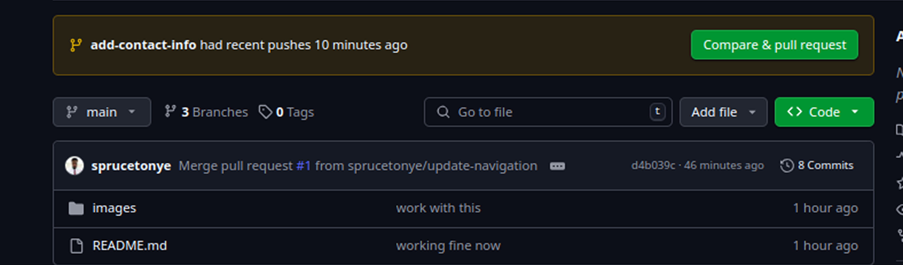

# Capstone Project - Git

 This is a capstone project that shows Tom and Jerry. 

<
The index.html file contains a sentence describing the purpose of the file

## Task 1: Create a Pull Request
1. Created a new pull request on github.

2. Checking the list of contibutors.

3. Ensuring pull request.

4. On the terminal switch to Jerry's branch `git checkout add-contact-info` command

5. On the terminal pull to get the update  `git pull origin main` command

6. Push the updated branch to github `git push origin add-contact-info` command

<!-- 7. Push the updated branch to github `git push origin add-contact-info` command

 -->